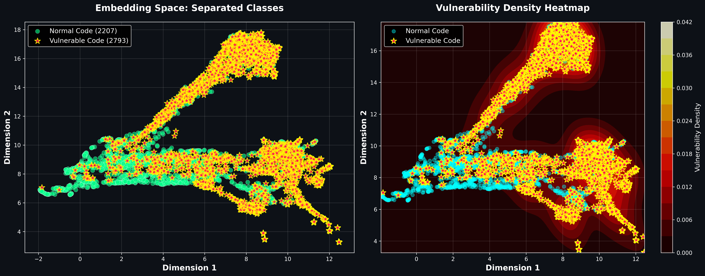

# GraphCodeVDS

# Детектирование уязвимостей в исходном коде с помощью GraphCodeBERT

Исследование обнаружения уязвимостей в коде на основе BERT.
Предварительный анализ пространства эмбеддингов демонстрирует способность предобученных моделей выявлять закономерности в исходном коде, что служит основанием для дальнейшего исследования специализированных архитектур.



## Основные результаты

### Сравнение моделей на датасете PrimeVul

| Модель | Precision | Recall | F1-Score | AUC | FPR |
|--------|-----------|--------|----------|-----|-----|
| CodeBERT (базовая) | 0.4494 | 0.0576 | **0.1020** | 0.8282 | — |
| GraphCodeBERT | 0.2511 | 0.1683 | **0.2016** | 0.8064 | 0.0138 |
| **GraphCodeBERT + SCL** | **0.2870** | **0.2747** | **0.2807** | **0.8382** | — |

**Метрика VD-S (Vulnerability Detection Score):** 0.8813

### Ключевые улучшения

- **F1-Score:** +175% относительно CodeBERT (0.1020 → 0.2807)
- **Recall:** +377% (0.0576 → 0.2747) - критически важно для обнаружения уязвимостей
- **Precision:** 0.2870 (контролируется через взвешивание классов)
- **AUC:** 0.8382 (+0.01 относительно базовой GraphCodeBERT)

## Датасет PrimeVul

Использованный датасет содержит исходный код с аннотированными уязвимостями:

| Раздел | Всего примеров | Уязвимые | Безопасные | % уязвимых |
|--------|---|---|---|---|
| Обучение (train) | 16,850 | 1,254 | 15,596 | 7.4% |
| Валидация (valid) | 3,522 | 291 | 3,231 | 8.3% |
| Тестирование (test) | 3,384 | 258 | 3,126 | 7.6% |

**Охват:** 44 различных типа CWE (Common Weakness Enumeration), включая:
- CWE-119: Buffer Overflow
- CWE-125: Out-of-bounds Read
- CWE-190: Integer Overflow
- CWE-416: Use-After-Free

## Методология

### Архитектура модели

**Энкодер:** GraphCodeBERT (125M параметров)
- Предварительно обучена на больших корпусах исходного кода
- Использует граф потока данных (Data Flow Graph, DFG) для лучшего понимания кода
- Выход CLS токена преобразуется в 768-мерное представление

**Классификационная голова:**
```
768 → FC → ReLU → LayerNorm → Dropout(0.3)
    ↓ 256
    → FC → ReLU → LayerNorm → Dropout(0.3)
    ↓ 128
    → FC → ReLU → LayerNorm → Dropout(0.3)
    ↓ 64
    → FC → Softmax → [2 класса]
```

**Голова проекции (для контрастивного обучения):**
```
768 → FC → ReLU → FC → L2-нормализация
    ↓ 256   ↓ 128
```

### Функции потерь

**CrossEntropyLoss с взвешиванием по классам:**
- Вес для класса "уязвимо" (w_vulnerable): 16.5
- Вес для класса "безопасно" (w_safe): 0.52
- Формула: w_c = N / (n_c × C), где N — общее количество примеров, n_c — количество примеров класса c

Это критически важно из-за дисбаланса классов (92.6% безопасного кода против 7.4% уязвимого).

**Supervised Contrastive Learning (SCL):**
- Температура: 0.07
- Функция контраста приводит к лучшему разделению класса в пространстве эмбедингов
- Объединённая функция потерь: 0.5 × CrossEntropy + 0.5 × ContrastiveLoss

### Обучение

- **Оптимизатор:** AdamW (lr=2e-5)
- **Batch size:** 64
- **Максимальная длина последовательности:** 512 токенов
- **Ранняя остановка:** patience=3 эпохи

### 1. Преимущество Graph-ориентированного подхода

GraphCodeBERT превосходит CodeBERT благодаря явному использованию графа потока данных (DFG). Это позволяет модели лучше понять:
- Зависимости между переменными
- Потоки управления в коде
- Опасные операции с буферами и указателями

### 2. Эффект Supervised Contrastive Learning

SCL улучшает разделение классов в эмбединг-пространстве:
- Примеры одного класса находятся близко друг к другу, а разных классов далеко друг от друга
- Дает некоторый прирост качества обнаружения уязвимостей

**Результат:** F1-score растёт с 0.20 до 0.28 (+39%)

### 3. Метрика VD-S = 0.8813

VD-S (Vulnerability Detection Score) объединяет FNR и FPR:
```
VD-S (FNR@FPR≤0.5%) = 1 - FNR
```
- FNR (False Negative Rate): 22.5% уязвимостей не обнаружены

VD-S метрика 0.8813 на валидационном наборе означает, что при ограничении
ложных срабатываний не более 0.5%, модель обнаруживает 88.13% уязвимостей.

### 5. Классификация CWE

Для 44 типов CWE с использованием fine-tuned GraphCodeBERT:
- **Accuracy:** 0.9725
- **F1-Score:** 0.9630

Модель отлично различает *типы* уязвимостей, но сложнее их *обнаруживает* в реальном коде.

## Ограничения и будущие работы

### Текущие ограничения

1. **Recall только 27.47%:** В production режиме это означает пропуск ~73% уязвимостей
2. **Максимальная длина 512 токенов:** Некоторые большие функции обрезаются
3. **Уровень функции:** Анализ функция-за-функцией, без контекста проекта

### Предложенные улучшения

1. **Focal Loss:** Дополнительное взвешивание для сложных негативных сепмплов
2. **Multi-task Learning:** Совместное обучение классификации уязвимостей и типов CWE
3. **Project-level анализ:** Учёт зависимостей между файлами
4. **Retrieval-Augmented Generation (RAG):** Использование базы CVE и CWE для улучшения предсказаний

```

## Лицензия

MIT License
